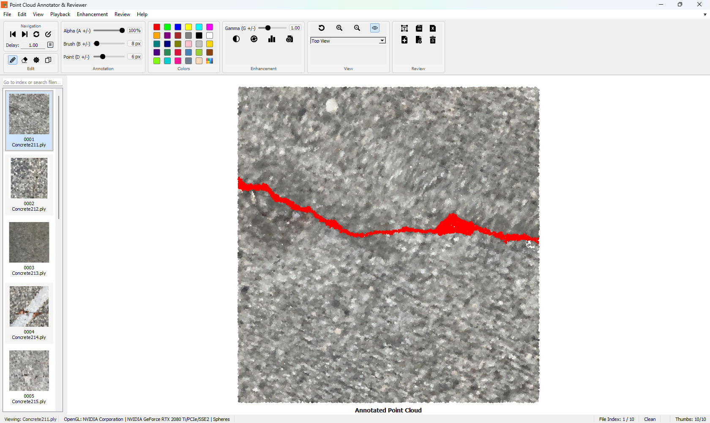
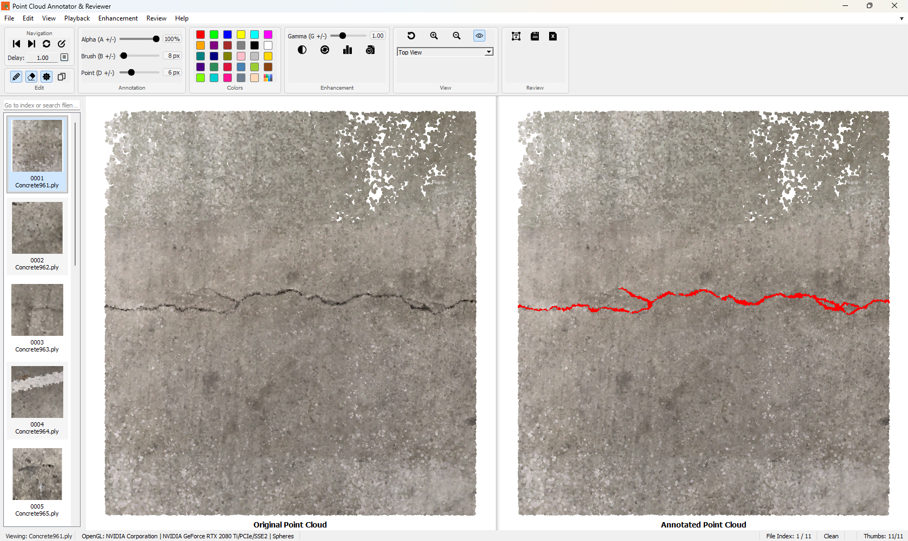
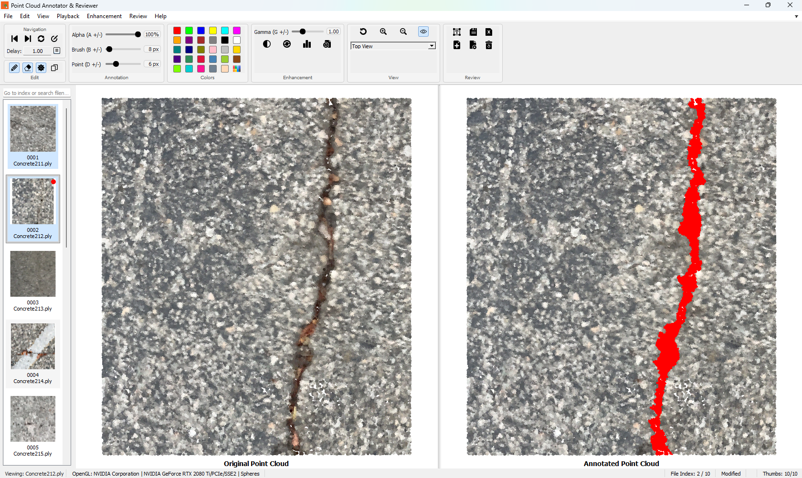
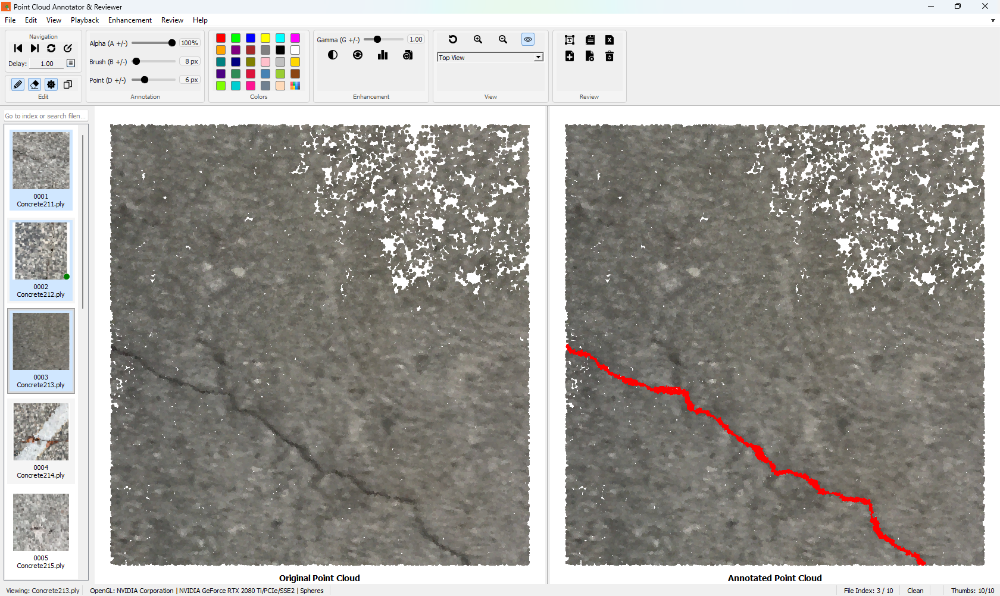
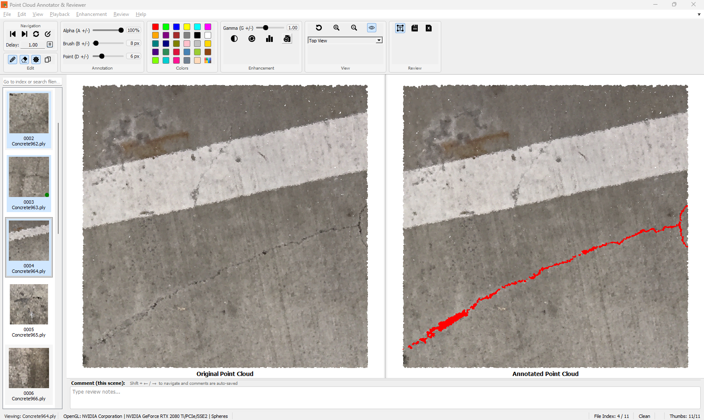

# Point Cloud Annotator & Reviewer

Semantic color annotation, review, and reporting tool for PLY/PCD point clouds. Version 2.0.0 introduced a modular architecture, a ribbon-first UI, dual-view repair/clone workflows, thumbnail-based navigation, and a precise WYSIWYG brush that respects screen-space point size. Version 2.5.0 builds a full review layer on top of that: per-file comments, automatically captured annotation statistics, one-click Excel reporting, a "copy original colors" tool with both single-file and folder-wide bulk modes, and Word-style ribbon display modes. Version 2.6.0 rounds out the review layer with a cumulative (append) mode that carries review data across folders and runs, plus one-click clear/restore backed by automatic, rotating backups.







---

## Table of Contents

1. Overview
2. What is New
3. Feature Matrix
4. Folder Structure
5. Installation
6. Quick Start
7. Workflow Guide
8. UI Tour
9. Review Workflow
10. Copy Original Point Cloud Colors
11. Controls and Shortcuts
12. Algorithms and Rendering Details
13. Data Model and File I/O
14. State, Cache, and Persistence
15. Architecture and Module Map
16. Performance Tuning
17. Packaging (Executable)
18. Troubleshooting and FAQ
19. Contributing
20. License

---

## 1. Overview

Point Cloud Annotator & Reviewer is a desktop application (PyQt5 + PyVista/VTK) for fast, high-precision semantic recoloring of dense point clouds, and for reviewing and reporting on that work afterward. Instead of polygon or bounding-box segmentation, you paint per-point RGB labels directly on PLY/PCD data, then optionally hand the same session off to a reviewer who leaves comments, checks coverage statistics, and exports a report — all inside the same tool.

The app serves two workflows around the same dataset:

- **Annotation.** Load a folder of point clouds and paint semantic classes onto them with a brush whose footprint matches exactly what you see on screen, at any zoom level and point size. An optional "original" folder holds the pristine, unannotated versions of the same files, used for side-by-side comparison, clone/repair painting, thumbnail generation, and automatic detection of which files have been touched.
- **Review.** Every file you visit can carry a short free-text comment and a stats snapshot — point counts, percentage of points annotated, a breakdown of how many points belong to each color/class, bounding box, file size, and the brush/gamma/alpha settings in effect. Comments and stats are saved automatically to a persistent review log and can be exported to a multi-sheet Excel workbook for QA sign-off, dataset audits, or handoff to a non-technical stakeholder.

Two goals drive the design throughout: **accurate brush footprints** that match what you see on screen, and **efficient review** — of individual files while annotating, and of an entire dataset once annotation is done. The app targets both the person doing the labeling and the person checking the work, without needing a second tool for the checking part.

---

## 2. What is New

### 2.6.0

- New **Append Review Data (Cumulative)** toggle (Review ribbon group and **Review** menu). When on, review data — comments and stats — keeps accumulating across folders and app runs instead of resetting each time you open a new annotation folder; when off (the default), switching folders starts the review log over. The setting is remembered between sessions.
- New **Clear Review Data** action (Review ribbon group and **Review** menu): a deliberate, confirmed wipe of the entire review record. A timestamped backup is written first, so an accidental clear is always recoverable.
- New **Restore Review Data** action (Review ribbon group and **Review** menu): pick a saved backup from a list and roll the review log back to it. The current data is backed up before the restore, so a restore is itself undoable.
- Automatic, rotating **review backups** in the app data dir: a one-deep `review.prev.json` snapshot taken right before an off-mode auto-reset, plus a rotating `review_backups/` folder (the last 10 backups kept) written before every manual clear or restore.
- The **Show Review Textbox** panel state is now persisted, so the comment panel reopens shown or hidden exactly as you left it on the previous run.
- New review ribbon icons for the append, clear, and restore actions, and a second row in the **Review** ribbon group to hold them.

### 2.5.0

- App renamed to **Point Cloud Annotator & Reviewer** (v2.5.0) to reflect the new review/reporting capabilities alongside annotation.
- New **Review** ribbon group and **Review** menu: a toggleable per-file comment textbox (`Ctrl+Shift+T`), **Save Comment**, and **Export to Excel**.
- Persistent **review log** (`review.json` in the app data dir) recording, per file: your comment, point counts, annotated/unannotated percentages, a per-color class breakdown, bounding box and centroid, file size/modified time, and the brush size, point size, annotation alpha, gamma, and points-as-spheres setting in effect at save time.
- One-click **Export to Excel** (via `openpyxl`) producing a three-sheet workbook — Summary, Class Breakdown, and Session Info — for every file that has been reviewed or saved.
- New **"Copied Original Colors"** annotation status, tracked independently from Clean/Modified/Annotated, so files restored this way are distinguishable from hand-painted ones in the nav dock, status bar, and review log.
- New **Copy Original Point Cloud Colors** tool (Enhancement ribbon group and Enhancement menu), offering two modes from the same popup: **Single File Copy** restores original RGB into the currently open file only, for every point except an "ignore" color you choose, with full undo/redo support; **Bulk Copy** applies that same ignore-color merge across every annotation file that has a matching Original file, in parallel, with a cancelable progress dialog — it writes straight to disk and is not undoable.
- **Tools** menu renamed to **Enhancement** and reorganized to host Auto Contrast, Reset Contrast, Show RGB Histograms, and Copy Original Point Cloud Colors together.
- New **Ribbon Display Options** chevron (top-right of the menu bar): switch between Full-screen Mode, Hide Ribbon, and Always Show Ribbon; `Esc` exits full-screen.
- `Shift+Left` / `Shift+Right` now navigate to the previous/next file while the review textbox has keyboard focus, so you can comment and move on without touching the mouse.
- Cleaner custom ribbon icons — transparent padding is auto-trimmed so the new Copy, Textbox, Save Comment, and Export Excel glyphs render at the same visual size as the existing hand-drawn icons.

### Also from 2.0.0

- Modular codebase under `python/` with separate UI, controllers, rendering, and services modules.
- Ribbon toolbar with grouped controls for navigation, annotation, color, enhancement, and view.
- Dual-pane split view for Repair and Clone modes with synchronized cameras.
- Annotation visibility alpha (blend between original and annotated colors).
- Navigation dock with searchable list, thumbnails, and status dots (dirty/annotated).
- Background thumbnail generation and persistent cache.
- Loop playback with configurable delay presets.
- WYSIWYG brush footprint that accounts for point sprite size.
- Shift-drag straight line painting and stroke-level undo/redo.
- Robust state persistence for last folders, index, and dock width.

---

## 3. Feature Matrix

| Category    | Capabilities                                                                                     |
| ----------- | ------------------------------------------------------------------------------------------------ |
| Formats     | PLY and PCD (binary write); auto-inject RGB channel if missing                                   |
| Annotation  | Brush with adjustable size, eraser, undo/redo, per-stroke history                                |
| Precision   | Screen-space aware brush (point size aware), KD-tree candidate search                            |
| Views       | Top, bottom, front, back, left, right, SW/SE/NW/NE isometrics                                    |
| Split Mode  | Repair mode (side-by-side original + annotated) and Clone mode                                   |
| Navigation  | Previous/Next, loop playback, quick index or filename search                                     |
| Thumbnails  | Background generation, cache, and annotated/dirty indicators                                     |
| Enhancement | Gamma slider, auto contrast, RGB histogram viewer, copy original colors (single file or bulk)    |
| Review      | Per-file comments, auto-saved review log, class stats, Excel export, cumulative mode, backups    |
| Display     | Adjustable point size, overlay titles, annotation alpha, full-screen / hide-ribbon display modes |
| Persistence | Remembers folders, index, and nav dock width                                                     |

---

## 4. Folder Structure

```
Point Cloud Annotator/
├─ README.md
├─ LICENSE
├─ assets/
│  ├─ overview_01.png
│  ├─ overview_02.png
│  ├─ overview_03.png
│  ├─ overview_04.png
│  └─ overview_05.png
├─ python/
│  ├─ app.py
│  ├─ requirements.txt
│  ├─ configs/
│  │  ├─ __init__.py
│  │  └─ constants.py
│  ├─ controllers/
│  │  ├─ __init__.py
│  │  ├─ annotation.py
│  │  ├─ app_helpers.py
│  │  ├─ bootstrap.py
│  │  ├─ interaction.py
│  │  ├─ io.py
│  │  ├─ nav_ui.py
│  │  ├─ navigation.py
│  │  ├─ review.py
│  │  └─ ui_controls.py
│  ├─ rendering/
│  │  ├─ __init__.py
│  │  └─ camera.py
│  ├─ services/
│  │  ├─ __init__.py
│  │  ├─ annotation_state.py
│  │  ├─ annotation_stats.py
│  │  ├─ bulk_copy.py
│  │  ├─ excel_export.py
│  │  ├─ review_store.py
│  │  ├─ storage.py
│  │  └─ thumbnail.py
│  ├─ ui/
│  │  ├─ __init__.py
│  │  ├─ copy_color_panel.py
│  │  ├─ icons.py
│  │  ├─ layout.py
│  │  ├─ menu.py
│  │  ├─ nav_dock.py
│  │  ├─ overlays.py
│  │  ├─ review_panel.py
│  │  └─ ribbon.py
│  └─ icons/
│     ├─ app.png
│     ├─ app.ico
│     ├─ annotate.png
│     ├─ append-json.png
│     ├─ clear-review.png
│     ├─ clone.png
│     ├─ contrast.png
│     ├─ copy-arrow.png
│     ├─ eraser.png
│     ├─ export-excel.png
│     ├─ histogram.png
│     ├─ loop.png
│     ├─ next.png
│     ├─ previous.png
│     ├─ repair.png
│     ├─ reset.png
│     ├─ reset-contrast.png
│     ├─ restore-json.png
|     ├─ revision.png
│     ├─ save-comment.png
│     ├─ textbox.png
│     ├─ view.png
│     ├─ zoom-in.png
│     └─ zoom-out.png
└─ installer/ (optional)
```

---

## 5. Installation

### 5.1 Requirements

- Python 3.9+ (3.10-3.12 recommended)
- OpenGL 2.1+ capable GPU and drivers for VTK
- Windows, macOS, or Linux

### 5.2 Install (Virtual Environment)

From the repo root:

```pwsh
python -m venv .venv
.\.venv\Scripts\Activate.ps1
python -m pip install --upgrade pip setuptools wheel
python -m pip install -r python\requirements.txt
```

`requirements.txt` includes `openpyxl`, which the Review feature uses to build `.xlsx` reports (see [9. Review Workflow](#9-review-workflow)).

---

## 6. Quick Start

```pwsh
python python\app.py
```

Then:

1. Open an annotation folder with PLY/PCD files.
2. (Optional) Open an original folder with matching filenames for comparison.
3. Enable annotation mode and start painting.
4. (Optional) Press `Ctrl+Shift+T` to open the review textbox and leave a comment on the current file; it is auto-saved as you type.

---

## 7. Workflow Guide

### 7.1 Annotation and Original Folders

- Annotation folder: where you read and write the annotated PLY/PCD files.
- Original folder (optional): used for repair/clone workflows, thumbnails, annotation detection, and as the source of truth for the Copy Original Point Cloud Colors tool.

If an original file exists and matches point count, its RGB values are treated as the true baseline when computing edits.

### 7.2 Save Behavior

- Manual save prompts whether to bake enhanced (gamma/contrast) colors into untouched points.
- Autosave can be enabled from the File menu. If on, the app saves before navigation when edits exist.
- Every save also records a fresh annotation-stats snapshot into the review log (see [9.2 Annotation Stats Captured](#92-annotation-stats-captured)), so the review log stays in sync with what's on disk.

---

## 8. UI Tour

### 8.1 Ribbon

- Navigation: prev/next, loop toggle, delay presets
- Annotation: alpha, brush size, point size
- Color: quick swatches and color picker
- Edit: annotation mode, eraser, repair, clone
- Enhancement: gamma slider, auto contrast, histograms, copy original point cloud colors (single file or bulk)
- View: reset view, zoom, view presets, show annotations
- Review: show/hide review textbox, save comment, export to Excel; append (cumulative) mode toggle, clear review data, restore review data

### 8.2 Navigation Dock

- Search by index (1-based) or partial filename
- Thumbnail list with dirty and annotated indicators
- Fast single-click navigation

### 8.3 Overlays

- Titles for original and annotated viewports
- Status bar for file index, loop state, thumbnail progress, and annotation status (Clean / Modified / Annotated / Copied Original Colors)

### 8.4 Ribbon Display Options

A small chevron button (`▾`) sits at the top-right of the menu bar and opens a Word-style display menu:

- **Full-screen Mode** — hides window chrome and expands the canvas; `Esc` returns to Always Show Ribbon.
- **Hide Ribbon** — detaches the ribbon toolbar to reclaim vertical space while keeping the menu bar and canvas.
- **Always Show Ribbon** — the default docked layout.

The three options are mutually exclusive. Switching modes re-fits the camera and repositions overlay titles automatically once the new layout settles.

---

## 9. Review Workflow

### 9.1 Review Textbox and Comments

Press `Ctrl+Shift+T` (or use **Review → Show Review Textbox**, or the ribbon's textbox button) to open a comment panel docked under the canvas. It is scoped **per file**: switching files swaps in that file's saved comment automatically. Comments are auto-saved as you type (on every text change) and again on:

- clicking the ribbon/menu **Save Comment** action (also records a stats snapshot and shows a brief toast),
- navigating to another file,
- closing the application.

`Shift+Left` / `Shift+Right` navigate to the previous/next file even while the comment box has keyboard focus, so review notes and navigation can be done without leaving the keyboard.

The panel's shown/hidden state is remembered between sessions, so it reopens exactly as you left it on the previous run.

### 9.2 Annotation Stats Captured

Each time stats are recorded for a file (on save, or when saving a comment), the app snapshots:

- Filename, annotation/original file paths, file index and total file count, format
- Annotation and original file size and modified time
- Point count, bounding box (min/max/extent), and centroid
- Annotated point count and percentage, unannotated point count and percentage
- Distinct annotation colors and a per-class breakdown (name — matched against the app's color swatches where possible, hex color, point count, percentage), capped at the 20 largest classes with the remainder rolled into an "Other" row
- Status label: `Clean`, `Modified`, `Annotated`, or `Copied Original Colors`
- Dirty / annotated / visited / copied-from-original flags
- Brush size, point size, annotation alpha, gamma, and render-as-spheres setting in effect
- Timestamp of the snapshot

### 9.3 The Review Log (`review.json`)

All comments and stats snapshots are stored keyed by absolute annotation file path in `review.json`, alongside `state.json` and the thumbnail cache (see [14. State, Cache, and Persistence](#14-state-cache-and-persistence)). The file also carries a `meta` block (app name, version, generation time, entry count). It is written incrementally as you work and flushed again on application close, so no explicit "save review log" step is required — only **Save Comment** to force an immediate write.

### 9.4 Exporting to Excel

**Review → Export to Excel** (or the ribbon's export button) flushes the current comment and stats, then writes a `.xlsx` workbook with three sheets:

1. **Summary** — one row per reviewed file: index, filename, status, paths, point counts, annotated/unannotated percentages, distinct colors, dirty/annotated/visited/copied flags, brush/point size, alpha, gamma, points-as-spheres, format, file size/modified time, bounding-box extent, centroid, comment, and timestamps.
2. **Class Breakdown** — one row per (filename, class) pair: class name, hex color, point count, and percentage.
3. **Session Info** — the `review.json` meta block (app name, version, generated-at, total entries).

The save dialog defaults to `<annotation-folder-name>_review.xlsx` in the last folder you exported to (or the annotation folder on first use), and requires the `openpyxl` package — already listed in `requirements.txt`. If it's missing, the app shows an install hint instead of failing silently.

### 9.5 Cumulative (Append) Mode

`review.json` is a single file keyed by absolute annotation file path. By default the review log is **per project**: when you open a different annotation folder, the log starts over so entries (and every future Excel export) aren't a mix of every folder you've ever touched.

Toggle **Append Review Data (Cumulative)** — in the **Review** ribbon group or the **Review** menu — to change that:

- **Off (default).** Opening a new annotation folder resets the review log. A one-deep snapshot is written first (see [9.6](#96-backups-clearing-and-restoring)) so the immediately-prior state can still be recovered.
- **On.** The review log is never reset on a folder switch; comments and stats keep accumulating across folders and across app runs. In this mode the record is only ever destroyed deliberately, via **Clear Review Data**.

The toggle is remembered between sessions, and the ribbon button and menu item stay in sync with each other.

### 9.6 Backups, Clearing, and Restoring

The review log is protected by automatic backups so a reset or a mistaken wipe is recoverable:

- **`review.prev.json`** — a single one-deep snapshot taken right before an off-mode auto-reset (the routine folder-switch case). It is overwritten each reset rather than rotated, so ordinary folder switches don't pile up backup files while the last-cleared state stays recoverable.
- **`review_backups/`** — a rotating folder of timestamped backups (the most recent 10 kept) written before every manual **Clear Review Data** and before every **Restore Review Data**.

**Clear Review Data** (Review ribbon group or **Review** menu) permanently empties the review log after a confirmation prompt that reports how many file entries will be removed. It writes a timestamped backup first and shows a brief toast when done.

**Restore Review Data** (Review ribbon group or **Review** menu) lists the available snapshots — the rotating backups plus the one-deep auto-reset snapshot — each labeled with its timestamp and entry count, newest first. Pick one and confirm to replace the current log with it. The current data is backed up before the restore, so a restore is itself undoable via another restore.

---

## 10. Copy Original Point Cloud Colors

Both modes share the same "ignore RGB, copy the rest from Original" merge and live in the same popup. Open it from the ribbon's Enhancement group (icon with an arrow) or **Enhancement → Copy Original Point Cloud Colors** in the menu, set an **ignore color** using the R/G/B spin boxes (a live swatch preview shows the current selection), then choose **Single File Copy** or **Bulk Copy**.

### 10.1 Single File Copy

Restores original colors into the **currently open file's** annotated cloud in one action, while preserving one chosen color — typically used to revert accidental or stale edits on the file you're looking at without losing manually painted classes.

> **Scope: single file, not a batch operation.** It only affects `app.colors` for the file at the current navigation index. It does not iterate over the rest of the annotation folder — use **Bulk Copy** (below) to apply the same merge across the whole folder, or open each file and repeat the action.

- Every point in the currently open annotated cloud whose current color does **not** match the ignore color is overwritten with that point's color from the corresponding original cloud, in one vectorized pass over that file's points.
- Points already equal to the ignore color are left untouched — this is how you protect one class (e.g., a specific defect color) while reverting everything else in that file.
- If every point already matches the ignore color, or the result would be identical to the original, the app reports that no changes were needed instead of recording a no-op edit.

#### 10.1.1 Undo, Status, and Persistence

- The change is pushed onto the undo/redo history as a single stroke-like entry, so `Ctrl+Z` reverts the whole copy in one step.
- The affected file is marked dirty and its status becomes **Copied Original Colors** — shown in the status bar and recorded in the review log — distinct from a hand-painted **Modified**/**Annotated** file.
- Painting, undoing, or redoing on the file afterward clears the "copied" status, since the unsaved state is no longer purely a copy of the original.
- A brief status-bar/tooltip message reports how many points were changed and which color was ignored.

### 10.2 Bulk Copy

Applies the same ignore-color merge across **every annotation file that has a matching file in the Original folder**, writing each result straight back to disk. Use it to revert a whole dataset (or clean up after a bad batch edit) without opening each file by hand.

> **Requires both folders.** Bulk Copy needs an Annotation folder and an Original folder open; if either is missing, the app prompts you to open both first.

- If the currently open file has unsaved edits, they're autosaved first so the bulk pass reads its latest in-memory state instead of a stale copy on disk.
- Files are paired by matching filename between the annotation and original folders; any annotation file with no same-named file in the Original folder is skipped and reported, not treated as an error.
- A confirmation dialog states how many files will be overwritten, the ignore color in effect, how many will be skipped, and warns that **this cannot be undone**.
- Processing runs off the UI thread across multiple worker processes (`joblib`, in small batches), with a cancelable progress dialog tracking files completed out of the total; canceling stops the pass after the in-flight batch finishes.
- Each file is merged and rewritten independently — PLY via `vtkPLYWriter` in binary mode, PCD via `PyVista.save(binary=True)` — the same writers a manual save uses.
- A completion summary reports counts of files **Updated**, **Unchanged** (nothing to copy), **Skipped** (no matching Original), **Errors** (with the first several messages shown), and **Cancelled** if you stopped it early.
- Bulk Copy writes directly to disk and bypasses the undo/redo history — it does **not** mark files with the **Copied Original Colors** status used by Single File Copy, since that status only tracks the current in-memory session. If any files were updated, the app refreshes thumbnails and the navigation list, clears undo/redo history, and reloads the file currently on screen so the UI matches what's on disk.

---

## 11. Controls and Shortcuts

| Action                           | Shortcut                 | Notes                                                       |
| -------------------------------- | ------------------------ | ----------------------------------------------------------- |
| Open Annotation Folder           | Menu                     | File menu                                                   |
| Open Original Folder             | Menu                     | File menu                                                   |
| Refresh Folders                  | Menu                     | Refreshes the files in annotation folder                    |
| Select Revise / Move To Folder   | Ctrl+Shift+M             | Option to select the folder to move point clouds            |
| Revise / Move To Folder          | Ctrl+M                   | Moves the point cloud to selected Revise / Move To Folder   |
| Save                             | Ctrl+S                   | Optional bake of enhanced colors; also records review stats |
| Autosave                         | Menu toggle              | File menu                                                   |
| Undo / Redo                      | Ctrl+Z / Ctrl+Y          | Per-stroke, also covers Copy Original Point Cloud Colors    |
| Annotation Mode                  | Ctrl+Alt+A               | Enable brush painting                                       |
| Show Annotations                 | Ctrl+A                   | Toggle annotation overlay                                   |
| Eraser                           | Ctrl+Shift+E             | Restores original colors                                    |
| Repair Mode                      | Ctrl+Shift+R             | Split view + eraser default                                 |
| Clone Mode                       | Ctrl+Shift+C             | Paint from original colors                                  |
| Brush Size                       | B then +/-               | 1-200 px                                                    |
| Point Size                       | D then +/-               | 1-20 px                                                     |
| Annotation Alpha                 | A then +/-               | 0-100 percent                                               |
| Gamma                            | G then +/-               | 0.1x to 3.0x                                                |
| Render Points as Spheres         | Ctrl+Shift+P             | Toggle sphere vs. flat point rendering                      |
| Copy Original Point Cloud Colors | Ribbon / Menu            | Enhancement group or Enhancement menu; no default shortcut  |
| Zoom (cursor-centered)           | Z then +/-               | Hold Z, adjust zoom under cursor                            |
| Zoom In                          | Ctrl+= / Ctrl++          | View menu                                                   |
| Zoom Out                         | Ctrl+-                   | View menu                                                   |
| Reset View                       | Ctrl+Shift+V             | Reset camera                                                |
| Views                            | Ctrl+T/B/F/V/L/R/W/E/I/O | Presets                                                     |
| Previous / Next                  | Left / Right             | Wraps                                                       |
| First / Last                     | Home / End               | -                                                           |
| Page Jump                        | PgUp / PgDown            | +/-10                                                       |
| Loop Playback                    | Ctrl+Shift+L             | Delay set in ribbon                                         |
| Toggle Nav Pane                  | Ctrl+N                   | Show or hide dock                                           |
| Straight Line Paint              | Shift + Drag             | Constrained stroke                                          |
| Show Review Textbox              | Ctrl+Shift+T             | Toggles the per-file comment panel                          |
| Save Comment                     | Ribbon / Menu            | Review group or Review menu; also snapshots stats           |
| Export to Excel                  | Ribbon / Menu            | Review group or Review menu                                 |
| Append Review Data               | Ribbon / Menu            | Cumulative mode; keeps entries across folders/runs          |
| Clear Review Data                | Ribbon / Menu            | Wipes review log (timestamped backup first)                 |
| Restore Review Data              | Ribbon / Menu            | Restore review log from a saved backup                      |
| Navigate While Commenting        | Shift + Left / Right     | Works even while the review textbox has focus               |
| Full-screen / Hide / Show Ribbon | Chevron menu (top-right) | Word-style ribbon display options                           |
| Exit Full-screen                 | Esc                      | Returns to Always Show Ribbon mode                          |

---

## 12. Algorithms and Rendering Details

### 12.1 WYSIWYG Brush Selection

1. Pick center point with `vtkPropPicker`.
2. Estimate world size for one screen pixel.
3. Query a KD-tree for candidate points within an inflated radius.
4. Project candidates to screen and keep only those fully inside the brush circle.

This produces a footprint that matches the on-screen brush ring and respects point sprite size.

### 12.2 Stroke Engine

- Freehand strokes are stamped along the path at a fixed fraction of brush size.
- Shift + drag constrains strokes to a straight line, still stamped for coverage.
- Undo/redo stores the entire set of indices and previous colors per stroke.

### 12.3 Gamma and Auto Contrast

- Gamma is applied after per-channel normalization.
- Auto contrast stretches 2nd to 98th percentiles.
- Only untouched points are updated to preserve painted edits.

### 12.4 Annotation Alpha

Annotation alpha blends between the enhanced base and the painted colors without destroying data.

### 12.5 Single File Copy

- Builds a boolean mask of points whose current color differs from the chosen ignore color (`np.all(colors == ignore, axis=1)`, inverted).
- Replaces the colors at those indices with the corresponding indices from the original cloud's RGB array in one vectorized assignment.
- The previous colors at the changed indices are pushed onto the undo history as a single entry, and the redo stack is cleared — identical bookkeeping to a manual stroke, so the rest of the undo/redo and dirty-tracking machinery needs no special-casing for it.

### 12.6 Bulk Copy

- Runs on a `QThread` so the UI stays responsive; the actual per-file merge (`services/bulk_copy.py: copy_colors_for_file`) is a plain, top-level, picklable function so it can be dispatched to separate worker processes.
- Annotation/original file pairs are split into batches of 16 and handed to `joblib.Parallel(n_jobs=-1, backend="loky")`; the thread emits a progress signal after each batch completes, which the GUI uses to advance the progress dialog.
- Per file: reads both clouds with PyVista, requires matching point counts and an `RGB` array on the Original, computes the same ignore-color mask as Single File Copy, and skips the write entirely if nothing would change (`"unchanged"` result) rather than rewriting an identical file.
- Changed files are written back in place — PLY via `vtkPLYWriter` (binary), PCD via `PyVista.save(binary=True)` — and the result (`updated` / `unchanged` / `error`) is collected back on the main thread once every batch finishes or the run is cancelled.
- On completion, the main thread aggregates results into a summary dialog, then — only if at least one file was updated — invalidates the thumbnail cache, rescans annotated files, repopulates the navigation dock, clears undo/redo history, and reloads the current file from disk.

---

## 13. Data Model and File I/O

- `RGB` is stored as uint8, shape `(N, 3)`.
- Missing RGB is created as zeros on load.
- PLY saves use `vtkPLYWriter` in binary mode.
- PCD saves use `PyVista.save(binary=True)`.
- Bulk Copy reuses these same two writers from its worker processes, so files it rewrites are byte-format-compatible with a manual save.

Optional original folder:

- If a matching file exists with the same point count, it is used as the baseline.
- This baseline drives clone/repair, annotation detection, and both modes of the Copy Original Point Cloud Colors tool.

---

## 14. State, Cache, and Persistence

### 14.1 State File

Stored via `appdirs.user_data_dir`:

- `state.json` contains the last annotation folder, original folder, file index, nav dock width, last Excel export directory, the review append (cumulative) mode toggle, and the Show Review Textbox panel state.

### 14.2 Thumbnail Cache

- Thumbnails are generated off-screen with PyVista and stored in `thumbs/` under the same app data dir.
- Cache can be cleared from the File menu.
- Cache is pruned automatically when original datasets change.

### 14.3 Review Log

- `review.json`, stored alongside `state.json` in the same app data directory, holds every file's comment and latest annotation-stats snapshot (see [9.3 The Review Log](#93-the-review-log-reviewjson)).
- Loaded once at startup (`ReviewStore.load`) and written incrementally throughout the session; a final flush happens on application close.
- Not cleared by "Clear Thumbnail Cache" — it is independent of the thumbnail cache and persists across sessions.
- With append (cumulative) mode **off** (the default), opening a different annotation folder resets `review.json`; with it **on**, entries persist across folder changes and runs (see [9.5 Cumulative (Append) Mode](#95-cumulative-append-mode)).
- Protected by automatic backups in the same directory: a one-deep `review.prev.json` snapshot before an off-mode auto-reset, and a rotating `review_backups/` folder (last 10 kept) written before every manual clear or restore (see [9.6 Backups, Clearing, and Restoring](#96-backups-clearing-and-restoring)).

---

## 15. Architecture and Module Map

- `python/app.py`: Entry point and main `Annotator` window
- `python/controllers/`: Interaction, painting, navigation, I/O, and review (`review.py` — comments, stats capture, append/cumulative mode, and clear/restore with backups)
- `python/ui/`: Ribbon, menus, navigation dock, overlays, review panel (`review_panel.py`), and the copy-colors popup (`copy_color_panel.py`)
- `python/rendering/`: Camera control and view synchronization
- `python/services/`: State storage, thumbnail generation, annotation detection, annotation statistics (`annotation_stats.py`), the review log store (`review_store.py`), Excel export (`excel_export.py`), and the picklable per-file worker for Bulk Copy (`bulk_copy.py`)
- `python/configs/`: Constants and app directories

---

## 16. Performance Tuning

- Reduce brush size for ultra-dense clouds.
- Lower point size for faster redraw in heavy scenes.
- Use downsampled clouds for annotation, then transfer colors by nearest neighbor.
- Keep the original folder on a fast disk to speed thumbnail generation.
- Single File Copy is a single vectorized NumPy operation over all points in the current file, so it stays fast even on dense clouds — no need to brush over the whole file by hand to revert it.
- Bulk Copy parallelizes that same operation across files using `joblib` worker processes (`n_jobs=-1`), so reverting an entire dataset is far faster than opening each file and running Single File Copy by hand; it is still bounded by disk I/O for very large or very many files.

---

## 17. Packaging (Executable)

### 17.1 PyInstaller (example)

From the repo root:

```pwsh
pyinstaller --noconfirm --onedir --windowed --icon "\python\icons\app.ico" --contents-directory "." --add-data "\python\configs;configs/" --add-data "\python\controllers;controllers/" --add-data "\python\icons;icons/" --add-data "\python\rendering;rendering/" --add-data "\python\services;services/" --add-data "\python\ui;ui/"  "\python\app.py"

With paths:

pyinstaller --noconfirm --onedir --windowed --icon "D:\OneDrive\Education Materials\Applications\Toolboxes\Python\My Functions\Point Cloud Annotator & Reviewer\python\icons\app.ico" --contents-directory "." --add-data "D:\OneDrive\Education Materials\Applications\Toolboxes\Python\My Functions\Point Cloud Annotator & Reviewer\python\configs;configs/" --add-data "D:\OneDrive\Education Materials\Applications\Toolboxes\Python\My Functions\Point Cloud Annotator & Reviewer\python\controllers;controllers/" --add-data "D:\OneDrive\Education Materials\Applications\Toolboxes\Python\My Functions\Point Cloud Annotator & Reviewer\python\icons;icons/" --add-data "D:\OneDrive\Education Materials\Applications\Toolboxes\Python\My Functions\Point Cloud Annotator & Reviewer\python\rendering;rendering/" --add-data "D:\OneDrive\Education Materials\Applications\Toolboxes\Python\My Functions\Point Cloud Annotator & Reviewer\python\services;services/" --add-data "D:\OneDrive\Education Materials\Applications\Toolboxes\Python\My Functions\Point Cloud Annotator & Reviewer\python\tests;tests/" --add-data "D:\OneDrive\Education Materials\Applications\Toolboxes\Python\My Functions\Point Cloud Annotator & Reviewer\python\ui;ui/"  "D:\OneDrive\Education Materials\Applications\Toolboxes\Python\My Functions\Point Cloud Annotator & Reviewer\python\app.py"
```

If you add other assets, include them with `--add-data` as needed. Since `services/` and `ui/` are already bundled, the new review and copy-colors modules (`services/review_store.py`, `services/annotation_stats.py`, `services/excel_export.py`, `services/bulk_copy.py`, `ui/review_panel.py`, `ui/copy_color_panel.py`) require no extra `--add-data` entries — only ensure `openpyxl` and `joblib` are installed in the environment PyInstaller runs from, so they get bundled automatically.

---

## 18. Troubleshooting and FAQ

| Issue                           | Cause                      | Resolution                                                                                                                       |
| ------------------------------- | -------------------------- | -------------------------------------------------------------------------------------------------------------------------------- |
| Blank render window             | OpenGL or driver issue     | Update GPU drivers, test basic VTK script                                                                                        |
| Slow painting                   | Dense cloud or large brush | Reduce brush size, downsample                                                                                                    |
| Thumbnails not showing          | Cache not built yet        | Wait for background worker or clear cache                                                                                        |
| Enhanced colors missing         | Save option set to No      | Re-save and choose Yes                                                                                                           |
| Zoom feels jumpy in split view  | Cameras are linked         | Use smaller steps or reset view                                                                                                  |
| Export to Excel fails           | `openpyxl` not installed | `pip install openpyxl` (also listed in `requirements.txt`)                                                                   |
| Review comment doesn't reappear | Different file/path opened | Comments are keyed by absolute annotation file path; ensure the same file path is reopened                                       |
| Bulk Copy prompts for folders   | No Original folder open    | Bulk Copy needs both an Annotation folder and an Original folder open first                                                      |
| Bulk Copy skips some files      | No matching Original file  | Files without a same-named file in the Original folder are skipped and listed in the completion summary, not treated as an error |

FAQ:

Q: Can I export class IDs instead of RGB?
A: Not directly. The app stores semantics as RGB. You can maintain a color-to-class mapping externally, or use the Export to Excel Class Breakdown sheet, which already resolves swatch colors to class names.

Q: How do I adjust auto-contrast percentiles?
A: Edit `apply_auto_contrast` in `python/controllers/annotation.py`.

Q: Where is my review data stored, and can I back it up?
A: In `review.json`, in the same per-user app data directory as `state.json` (see [14.3 Review Log](#143-review-log)). Copy that file to back it up or move it between machines. The app also keeps its own rotating backups in `review_backups/` and a one-deep `review.prev.json` next to it, which **Restore Review Data** reads from.

Q: My review comments disappeared after I opened a different annotation folder — how do I keep them?
A: By default the review log is per project, so switching folders starts it over. Turn on **Append Review Data (Cumulative)** in the Review ribbon group or Review menu to keep entries across folders and runs. To get back the log you just lost, use **Restore Review Data** and pick the most recent snapshot (see [9.6 Backups, Clearing, and Restoring](#96-backups-clearing-and-restoring)).

Q: Does Copy Original Point Cloud Colors overwrite my hand-painted annotations?
A: Only for points that don't match the ignore color you set. Set the ignore color to whatever class you want to protect, and everything else reverts to the original.

Q: Can I undo a Bulk Copy?
A: No. Single File Copy pushes onto the undo/redo history like a normal stroke, but Bulk Copy writes each file straight to disk from background worker processes and clears the undo/redo history when it finishes. Back up your annotation folder first if you want a safety net, and double-check the ignore color before confirming.

---

## 19. Contributing

1. Fork and create a feature branch.
2. Keep PRs focused and include screenshots for UI changes.
3. Format with `black` and follow PEP 8.

Bug report template:

```
OS:
Python:
GPU/Driver:
Steps:
Expected:
Actual:
Sample Data (if possible):
```

---

## 20. License

MIT License. See `LICENSE` for details.
