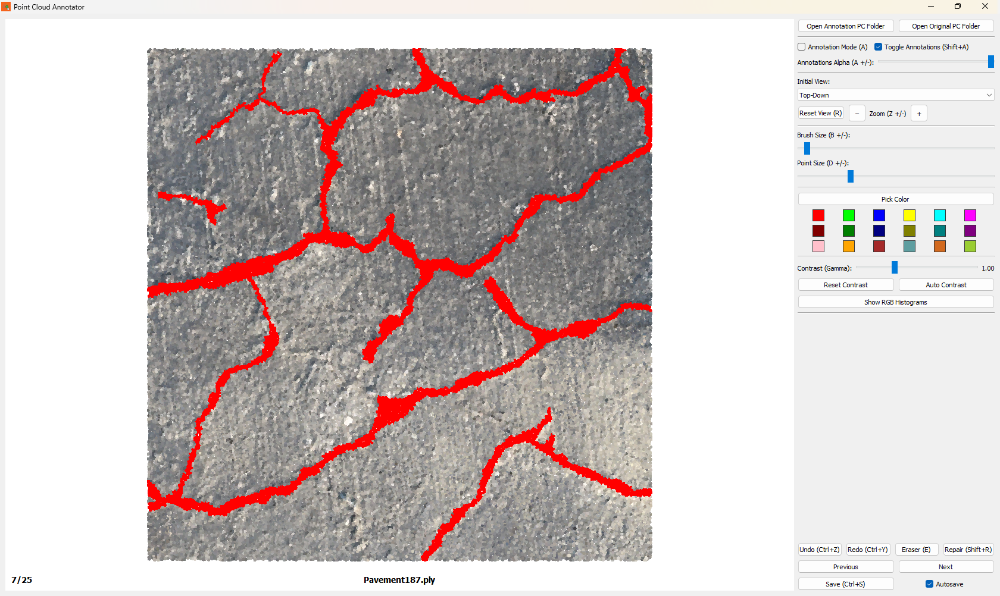
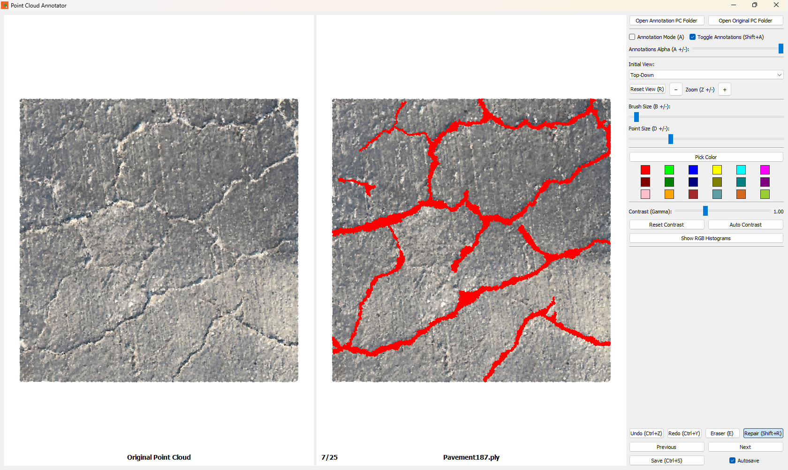
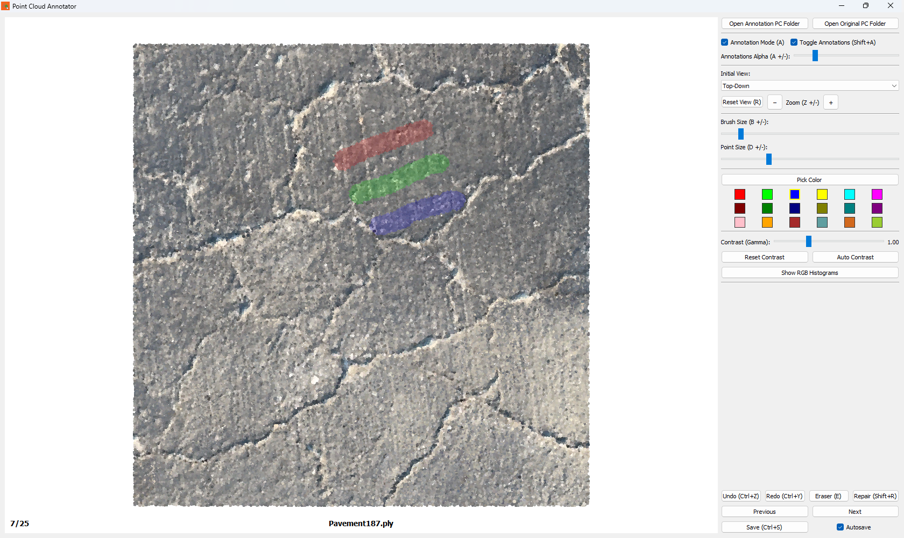

# Point Cloud Annotator

Semantic color annotation and review tool for PLY/PCD point clouds. Version 2.0.0 introduces a modular architecture, a ribbon-first UI, dual-view repair/clone workflows, thumbnail-based navigation, and a more precise WYSIWYG brush that respects screen-space point size.






---

## Table of Contents

1. Overview
2. What is New in 2.0.0
3. Feature Matrix
4. Folder Structure
5. Installation
6. Quick Start
7. Workflow Guide
8. UI Tour
9. Controls and Shortcuts
10. Algorithms and Rendering Details
11. Data Model and File I/O
12. State, Cache, and Persistence
13. Architecture and Module Map
14. Performance Tuning
15. Packaging (Executable)
16. Troubleshooting and FAQ
17. Contributing
18. License

---

## 1. Overview

Point Cloud Annotator is built for fast, high-precision semantic recoloring of point clouds. Instead of polygon segmentation, you paint per-point RGB labels directly on dense PLY/PCD data. The app emphasizes two goals:

- Accurate brush footprints that match what you see on screen
- Efficient review and navigation of large datasets

You can load an annotation folder and (optionally) a matching original folder. The original folder is used for side-by-side comparison, clone/repair workflows, thumbnail generation, and annotation detection.

---

## 2. What is New in 2.0.0

- Modular codebase under `python/` with separate UI, controllers, rendering, and services modules
- Ribbon toolbar with grouped controls for navigation, annotation, color, enhancement, and view
- Dual-pane split view for Repair and Clone modes with synchronized cameras
- Annotation visibility alpha (blend between original and annotated colors)
- Navigation dock with searchable list, thumbnails, and status dots (dirty/annotated)
- Background thumbnail generation and persistent cache
- Loop playback with configurable delay presets
- More precise WYSIWYG brush footprint that accounts for point sprite size
- Shift-drag straight line painting and stroke-level undo/redo
- Robust state persistence for last folders, index, and dock width

---

## 3. Feature Matrix

| Category    | Capabilities                                                          |
| ----------- | --------------------------------------------------------------------- |
| Formats     | PLY and PCD (binary write); auto-inject RGB channel if missing        |
| Annotation  | Brush with adjustable size, eraser, undo/redo, per-stroke history     |
| Precision   | Screen-space aware brush (point size aware), KD-tree candidate search |
| Views       | Top, bottom, front, back, left, right, SW/SE/NW/NE isometrics         |
| Split Mode  | Repair mode (side-by-side original + annotated) and Clone mode        |
| Navigation  | Previous/Next, loop playback, quick index or filename search          |
| Thumbnails  | Background generation, cache, and annotated/dirty indicators          |
| Enhancement | Gamma slider, auto contrast, RGB histogram viewer                     |
| Display     | Adjustable point size, overlay titles, annotation alpha               |
| Persistence | Remembers folders, index, and nav dock width                          |

---

## 4. Folder Structure

```
Point Cloud Annotator/
├─ README.md
├─ LICENSE
├─ assets/
│  ├─ overview_01.png
│  ├─ overview_02.png
│  ├─ overview_03.png
│  └─ overview_04.png
├─ python/
│  ├─ app.py
│  ├─ requirements.txt
│  ├─ configs/
│  │  ├─ __init__.py
│  │  └─ constants.py
│  ├─ controllers/
│  │  ├─ __init__.py
│  │  ├─ annotation.py
│  │  ├─ app_helpers.py
│  │  ├─ bootstrap.py
│  │  ├─ interaction.py
│  │  ├─ io.py
│  │  ├─ nav_ui.py
│  │  ├─ navigation.py
│  │  └─ ui_controls.py
│  ├─ rendering/
│  │  ├─ __init__.py
│  │  └─ camera.py
│  ├─ services/
│  │  ├─ __init__.py
│  │  ├─ annotation_state.py
│  │  ├─ storage.py
│  │  └─ thumbnail.py
│  ├─ ui/
│  │  ├─ __init__.py
│  │  ├─ icons.py
│  │  ├─ layout.py
│  │  ├─ menu.py
│  │  ├─ nav_dock.py
│  │  ├─ overlays.py
│  │  └─ ribbon.py
│  └─ icons/
│     ├─ app.png
│     ├─ app.ico
│     ├─ annotate.png
│     ├─ clone.png
│     ├─ contrast.png
│     ├─ eraser.png
│     ├─ histogram.png
│     ├─ loop.png
│     ├─ next.png
│     ├─ previous.png
│     ├─ repair.png
│     ├─ reset.png
│     ├─ reset-contrast.png
|     ├─ revision.png
│     ├─ view.png
│     ├─ zoom-in.png
│     └─ zoom-out.png
├─ installer/ (optional)
└─ Archive/ (optional)
```

---

## 5. Installation

### 5.1 Requirements

- Python 3.9+ (3.10-3.12 recommended)
- OpenGL 2.1+ capable GPU and drivers for VTK
- Windows, macOS, or Linux

### 5.2 Install (Virtual Environment)

From the repo root:

```pwsh
python -m venv .venv
.\.venv\Scripts\Activate.ps1
python -m pip install --upgrade pip setuptools wheel
python -m pip install -r python\requirements.txt
```

---

## 6. Quick Start

```pwsh
python python\app.py
```

Then:

1. Open an annotation folder with PLY/PCD files.
2. (Optional) Open an original folder with matching filenames for comparison.
3. Enable annotation mode and start painting.

---

## 7. Workflow Guide

### 7.1 Annotation and Original Folders

- Annotation folder: where you read and write the annotated PLY/PCD files.
- Original folder (optional): used for repair/clone workflows, thumbnails, and annotation detection.

If an original file exists and matches point count, its RGB values are treated as the true baseline when computing edits.

### 7.2 Save Behavior

- Manual save prompts whether to bake enhanced (gamma/contrast) colors into untouched points.
- Autosave can be enabled from the File menu. If on, the app saves before navigation when edits exist.

---

## 8. UI Tour

### 8.1 Ribbon

- Navigation: prev/next, loop toggle, delay presets
- Annotation: alpha, brush size, point size
- Color: quick swatches and color picker
- Edit: annotation mode, eraser, repair, clone
- Enhancement: gamma slider, auto contrast, histograms
- View: reset view, zoom, view presets, show annotations

### 8.2 Navigation Dock

- Search by index (1-based) or partial filename
- Thumbnail list with dirty and annotated indicators
- Fast single-click navigation

### 8.3 Overlays

- Titles for original and annotated viewports
- Status bar for file index, loop state, and thumbnail progress

---

## 9. Controls and Shortcuts

| Action                         | Shortcut                 | Notes                                                     |
| ------------------------------ | ------------------------ | --------------------------------------------------------- |
| Open Annotation Folder         | Menu                     | File menu                                                 |
| Open Original Folder           | Menu                     | File menu                                                 |
| Refresh Folders                | Menu                     | Refreshes the files in annotation folder                  |
| Select Revise / Move To Folder | Shift + M                | Option to select the folder to move point clouds          |
| Revise / Move To Folder        | M                        | Moves the point cloud to selected Revise / Move To Folder |
| Save                           | Ctrl+S                   | Optional bake of enhanced colors                          |
| Autosave                       | Menu toggle              | File menu                                                 |
| Undo / Redo                    | Ctrl+Z / Ctrl+Y          | Per-stroke                                                |
| Annotation Mode                | Ctrl+A                   | Enable brush painting                                     |
| Show Annotations               | Shift+A                  | Toggle annotation overlay                                 |
| Eraser                         | E                        | Restores original colors                                  |
| Repair Mode                    | Shift+R                  | Split view + eraser default                               |
| Clone Mode                     | C                        | Paint from original colors                                |
| Brush Size                     | B then +/-               | 1-200 px                                                  |
| Point Size                     | D then +/-               | 1-20 px                                                   |
| Annotation Alpha               | A then +/-               | 0-100 percent                                             |
| Gamma                          | G then +/-               | 0.1x to 3.0x                                              |
| Zoom                           | Z then +/-               | Cursor-centered zoom                                      |
| Reset View                     | R                        | Reset camera                                              |
| Views                          | Ctrl+T/B/F/V/L/R/W/E/I/O | Presets                                                   |
| Previous / Next                | Left / Right             | Wraps                                                     |
| First / Last                   | Home / End               | -                                                         |
| Page Jump                      | PgUp / PgDown            | +/-10                                                     |
| Loop Playback                  | L                        | Delay set in ribbon                                       |
| Toggle Nav Pane                | N                        | Show or hide dock                                         |
| Straight Line Paint            | Shift + Drag             | Constrained stroke                                        |

---

## 10. Algorithms and Rendering Details

### 10.1 WYSIWYG Brush Selection

1. Pick center point with `vtkPropPicker`.
2. Estimate world size for one screen pixel.
3. Query a KD-tree for candidate points within an inflated radius.
4. Project candidates to screen and keep only those fully inside the brush circle.

This produces a footprint that matches the on-screen brush ring and respects point sprite size.

### 10.2 Stroke Engine

- Freehand strokes are stamped along the path at a fixed fraction of brush size.
- Shift + drag constrains strokes to a straight line, still stamped for coverage.
- Undo/redo stores the entire set of indices and previous colors per stroke.

### 10.3 Gamma and Auto Contrast

- Gamma is applied after per-channel normalization.
- Auto contrast stretches 2nd to 98th percentiles.
- Only untouched points are updated to preserve painted edits.

### 10.4 Annotation Alpha

Annotation alpha blends between the enhanced base and the painted colors without destroying data.

---

## 11. Data Model and File I/O

- `RGB` is stored as uint8, shape `(N, 3)`.
- Missing RGB is created as zeros on load.
- PLY saves use `vtkPLYWriter` in binary mode.
- PCD saves use `PyVista.save(binary=True)`.

Optional original folder:

- If a matching file exists with the same point count, it is used as the baseline.
- This baseline drives clone/repair and annotation detection logic.

---

## 12. State, Cache, and Persistence

### 12.1 State File

Stored via `appdirs.user_data_dir`:

- `state.json` contains the last annotation folder, original folder, file index, and nav dock width.

### 12.2 Thumbnail Cache

- Thumbnails are generated off-screen with PyVista and stored in `thumbs/` under the same app data dir.
- Cache can be cleared from the File menu.
- Cache is pruned automatically when original datasets change.

---

## 13. Architecture and Module Map

- `python/app.py`: Entry point and main `Annotator` window
- `python/controllers/`: Interaction, painting, navigation, and I/O
- `python/ui/`: Ribbon, menus, navigation dock, overlays
- `python/rendering/`: Camera control and view synchronization
- `python/services/`: State storage, thumbnail generation, annotation detection
- `python/configs/`: Constants and app directories

---

## 14. Performance Tuning

- Reduce brush size for ultra-dense clouds.
- Lower point size for faster redraw in heavy scenes.
- Use downsampled clouds for annotation, then transfer colors by nearest neighbor.
- Keep the original folder on a fast disk to speed thumbnail generation.

---

## 15. Packaging (Executable)

### 15.1 PyInstaller (example)

From the repo root:

```pwsh
pyinstaller --noconfirm --onedir --windowed --icon "\python\icons\app.ico" --contents-directory "." --add-data "\python\configs;configs/" --add-data "\python\controllers;controllers/" --add-data "\python\icons;icons/" --add-data "\python\rendering;rendering/" --add-data "\python\services;services/" --add-data "\python\ui;ui/"  "\python\app.py"

With paths:

pyinstaller --noconfirm --onedir --windowed --icon "D:\OneDrive\Education Materials\Applications\Toolboxes\Python\My Functions\Point Cloud Annotator\python\icons\app.ico" --contents-directory "." --add-data "D:\OneDrive\Education Materials\Applications\Toolboxes\Python\My Functions\Point Cloud Annotator\python\configs;configs/" --add-data "D:\OneDrive\Education Materials\Applications\Toolboxes\Python\My Functions\Point Cloud Annotator\python\controllers;controllers/" --add-data "D:\OneDrive\Education Materials\Applications\Toolboxes\Python\My Functions\Point Cloud Annotator\python\icons;icons/" --add-data "D:\OneDrive\Education Materials\Applications\Toolboxes\Python\My Functions\Point Cloud Annotator\python\rendering;rendering/" --add-data "D:\OneDrive\Education Materials\Applications\Toolboxes\Python\My Functions\Point Cloud Annotator\python\services;services/" --add-data "D:\OneDrive\Education Materials\Applications\Toolboxes\Python\My Functions\Point Cloud Annotator\python\tests;tests/" --add-data "D:\OneDrive\Education Materials\Applications\Toolboxes\Python\My Functions\Point Cloud Annotator\python\ui;ui/"  "D:\OneDrive\Education Materials\Applications\Toolboxes\Python\My Functions\Point Cloud Annotator\python\app.py"
```

If you add other assets, include them with `--add-data` as needed.

---

## 16. Troubleshooting and FAQ

| Issue                          | Cause                      | Resolution                                |
| ------------------------------ | -------------------------- | ----------------------------------------- |
| Blank render window            | OpenGL or driver issue     | Update GPU drivers, test basic VTK script |
| Slow painting                  | Dense cloud or large brush | Reduce brush size, downsample             |
| Thumbnails not showing         | Cache not built yet        | Wait for background worker or clear cache |
| Enhanced colors missing        | Save option set to No      | Re-save and choose Yes                    |
| Zoom feels jumpy in split view | Cameras are linked         | Use smaller steps or reset view           |

FAQ:

Q: Can I export class IDs instead of RGB?
A: Not in 2.0.0. The app stores semantics as RGB. You can maintain a color-to-class mapping externally.

Q: How do I adjust auto-contrast percentiles?
A: Edit `apply_auto_contrast` in `python/controllers/annotation.py`.

---

## 17. Contributing

1. Fork and create a feature branch.
2. Keep PRs focused and include screenshots for UI changes.
3. Format with `black` and follow PEP 8.

Bug report template:

```
OS:
Python:
GPU/Driver:
Steps:
Expected:
Actual:
Sample Data (if possible):
```

---

## 18. License

MIT License. See `LICENSE` for details.
